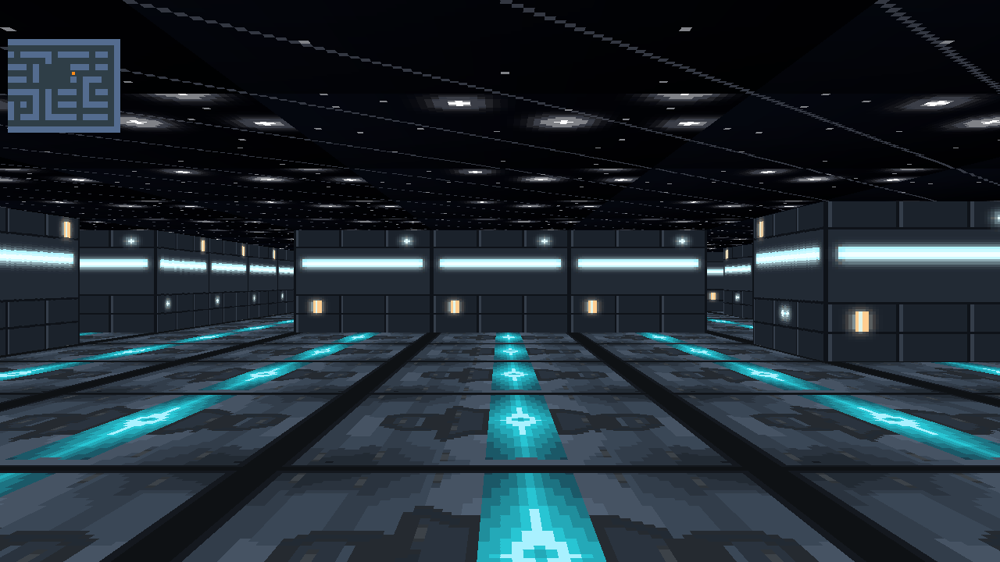
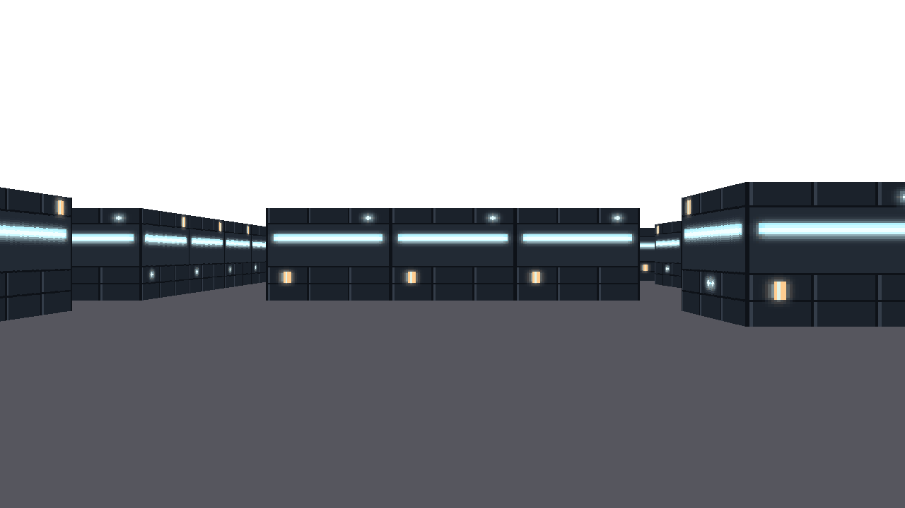

*This project has been created as part of the 42 curriculum by ragolden and adchebbi.*

# cub3D

> A first-person raycasting engine in C, in the spirit of *Wolfenstein 3D* (1992): a maze described in a `.cub`
> file is rendered in real time with the DDA algorithm and the MiniLibX graphics library.

    

<p align="center"></p>

*Bonus build on `maps/test.cub`: textured floor and starry ceiling, minimap in the top-left corner (orange dot = player).*

## Highlights

- **DDA raycasting**: one ray per screen column (1280 × 720), direction vector + camera plane model,
  perpendicular wall distance to avoid the fisheye effect.
- **Direction-dependent wall textures**: north, south, east and west walls each have their own XPM texture,
  sampled per column.
- **Smooth controls**: key press and key release are tracked separately, so movement and rotation are continuous;
  collision detection stops the player at walls.
- **Strict `.cub` parser**: elements in any order, duplicate and missing identifiers, RGB ranges, map closure,
  exactly one spawn point. Every error has a specific message.
- **Clean shutdown**: `ESC` and the window close button free every image, texture and the map. Error paths
  are leak-free under Valgrind.

## Mandatory and bonus

| | Mandatory (`cub3D`) | Bonus (`cub3D_bonus`) |
|---|---|---|
| Walls | 4 direction-specific textures | same |
| Floor / ceiling | Solid colors from `F` and `C` | **Textured floor and ceiling** (floor casting) |
| Minimap | — | **Live minimap** with the player's position |

<p align="center"></p>

*Mandatory build on the same map: textured walls, floor and ceiling colors taken from the `.cub` file.*

## Build & Run

Linux / WSL dependencies for MiniLibX:

```bash
sudo apt-get install xorg libxext-dev zlib1g-dev libbsd-dev
```

```bash
make                         # clones MiniLibX if needed, builds libft, MLX, then cub3D
./cub3D maps/test.cub

make bonus
./cub3D_bonus maps/test.cub
```

Other targets: `make clean`, `make fclean`, `make re`.

## Controls

| Key | Action |
|---|---|
| `W` `A` `S` `D` | Move forward / left / back / right |
| `←` `→` | Turn the camera |
| `ESC` or close button | Quit |

## The `.cub` scene file

Configuration lines can appear in any order. The map always comes last.

```
NO ./textures/north.xpm
SO ./textures/south.xpm
WE ./textures/west.xpm
EA ./textures/east.xpm
F 86,86,94
C 255,255,255

111111
100101
101001
1100N1
111111
```

- `NO` `SO` `WE` `EA`: wall textures for each direction (`.xpm`).
- `F` `C`: floor and ceiling colors as `R,G,B` in `[0, 255]`.
- Map: `1` wall, `0` floor, and one of `N` `S` `E` `W` for the player's spawn and orientation. The map must be
  closed by walls.

## Error handling

Invalid input is rejected with `Error` and a specific message, exit status 1. All of these cases were tested,
and the 13 file-related ones were also run under Valgrind, with no leaks:

| Input | Message |
|---|---|
| map open to the outside | `The map is not closed by walls` |
| no spawn / two spawns | `No player start position (N, S, E or W)` / `Several player start positions in the map` |
| invalid map character / empty line inside the map | `Invalid character in the map` / `Empty line inside the map` |
| wrong extension (`.cu`, `.cub` alone) / missing file | `The map file must have a .cub extension` / `Cannot open the .cub file` |
| color out of range | `Invalid color: expected R,G,B in [0,255]` |
| duplicate, unknown or missing identifier | `Duplicate texture identifier` / `Unknown identifier (use NO, SO, WE, EA, F, C)` / `Missing element (NO, SO, WE, EA, F or C)` |
| texture file not found | `Cannot open a texture file` |
| no argument | `Usage: ./cub3D <map.cub>` |

Configuration lines in a different order are accepted, as the subject requires.

## Project structure

```
.
├── Makefile
├── includes/            # cub3d.h, cub3d_bonus.h
├── libft/               # personal C library (with ft_printf and get_next_line)
├── maps/                # valid and invalid test scenes
├── textures/            # XPM wall, floor and ceiling textures
└── srcs/
    ├── main.c, init_mlx.c, cleanup.c, utils.c
    ├── parsing/         # .cub reading, config parsing, map extraction and validation
    ├── raycasting/      # ray setup, DDA, wall distance and column rendering
    ├── movement/        # key state, movement with collisions, rotation
    ├── handle_textures/ # texture loading, floor/ceiling rendering, minimap (bonus)
    └── render.c / render_bonus.c
```

## Resources

- [Ray-Casting tutorial](https://lodev.org/cgtutor/raycasting.html), lodev.org: the main reference for the DDA
  algorithm, the direction vector / camera plane model and the perpendicular wall distance, later extended to
  wall, floor and ceiling texture mapping
- [Ray-casting notes](https://hackmd.io/@nszl/H1LXByIE2): very useful to understand DDA and the fisheye
  correction, with good illustrations
- MiniLibX man pages: `mlx_init`, `mlx_new_window`, `mlx_hook`, `mlx_xpm_file_to_image`, `mlx_get_data_addr`
- *Wolfenstein 3D* (id Software, 1992), the historical reference for the genre

### AI usage

Claude (Anthropic) was used throughout this project as a learning and pair-programming assistant:

- **Explaining concepts and math**: breaking down the DDA algorithm, the direction/camera plane model and the
  perpendicular wall distance formula into applicable steps, without writing the implementation.

## 42 evaluation

Validated at **113/100** (bonus included) by 3 peer evaluations (team of 2).
Other students' names and photos are blurred.

<p align="center"></p>

## Authors

- **Raphael Goldenberg** ([@raphaelggg](https://github.com/raphaelggg)), 42 login `ragolden`
- **Adem Chebbi** ([@ademchbb](https://github.com/ademchbb)), 42 login `adchebbi`
